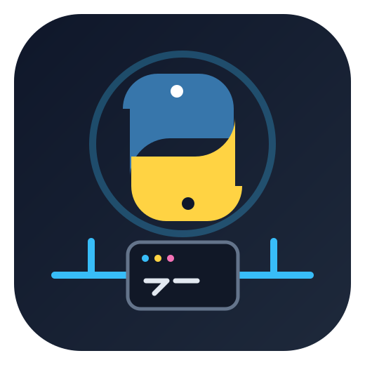

# Python REST API Platform

  

<h3 align="center">Portfolio-ready Flask REST API with Testing, Docker, Kubernetes & CI/CD</h3>

A compact Python backend project demonstrating REST API development, Swagger documentation, automated testing, containerization, Kubernetes deployment, and GitHub Actions CI/CD.

---

## 🎯 Project Overview

This project is a small Flask backend built around a calculator REST API. It demonstrates a practical path from business logic to a deployable Python service.

The repository includes Flask REST endpoints, Swagger documentation, automated tests, Docker, Docker Compose, Kubernetes manifests, and GitHub Actions automation.

## 🏗️ Architecture

\`\`\`text
Client
  │
  ▼
┌───────────────┐
│   Flask API   │
│    :5000      │
└───────┬───────┘
        │
   ┌────┴─────┐
   ▼          ▼
 Routes    Swagger UI
   │
   ▼
Calculator
 Business Logic
   │
   ▼
 Pytest

Deployment:
GitHub → GitHub Actions → Docker → Kubernetes → Service
\`\`\`

## ✨ Technology Stack

| Area | Technology |
|---|---|
| Language | Python 3.10+ |
| Framework | Flask |
| API | REST |
| Documentation | Swagger / Flasgger |
| Testing | pytest / pytest-cov |
| Containerization | Docker |
| Local orchestration | Docker Compose |
| Orchestration | Kubernetes |
| Automation | GitHub Actions |

## 📁 Project Structure

\`\`\`text
python-rest-api-platform/
├── .github/workflows/
│   └── first-workflow.yml
├── app/
│   ├── __init__.py
│   ├── calculator.py
│   ├── routes.py
│   └── swagger.py
├── k8s/
│   ├── deployment.yml
│   └── service.yml
├── tests/
│   ├── conftest.py
│   └── test_calculator_api.py
├── assets/logo/
│   └── python-api-lab-logo.svg
├── app.py
├── Dockerfile
├── docker-compose.yml
├── requirements.txt
├── sonar-project.properties
└── README.md
\`\`\`

## 🚀 API Endpoints

| Endpoint | Method | Purpose |
|---|---|---|
| `/add` | POST | Add two numbers |
| `/subtract` | POST | Subtract two numbers |
| `/multiply` | POST | Multiply two numbers |
| `/divide` | POST | Divide two numbers |
| `/is-even` | GET | Check whether a number is even |
| `/docs/` | GET | Swagger UI |

Example:

\`\`\`json
{"a":10,"b":5}
\`\`\`

## 📚 API Documentation

Run the service and open `http://localhost:5000/docs/`.

## 💻 Run Locally

\`\`\`bash
git clone https://github.com/amitweb2012/python-rest-api-platform.git
cd python-rest-api-platform

python3 -m venv .venv
source .venv/bin/activate
pip install -r requirements.txt

python app.py
\`\`\`

Application: `http://localhost:5000`

## 🧪 Testing

\`\`\`bash
pytest -v
pytest --cov=app --cov-report=term-missing
\`\`\`

## 🐳 Docker

\`\`\`bash
docker build -t python-rest-api-platform .
docker run --rm -p 5000:5000 python-rest-api-platform
\`\`\`

### Docker Compose

\`\`\`bash
docker compose up --build
\`\`\`

## ☸️ Kubernetes

\`\`\`bash
kubectl apply -f k8s/deployment.yml
kubectl apply -f k8s/service.yml

kubectl get pods
kubectl get svc
\`\`\`

## 🔄 CI/CD

The existing GitHub Actions workflow integrates a reusable CI pipeline and a Minikube deployment stage.

\`\`\`text
Push / Pull Request
        │
        ▼
 GitHub Actions
        │
   Build + Test
        │
        ▼
   Docker Image
        │
        ▼
    Minikube
        │
        ▼
 Kubernetes Verification
\`\`\`

## 🎓 Portfolio Skills Demonstrated

- Python backend development
- Flask REST API design
- Separation of routes and business logic
- Swagger API documentation
- Automated testing
- Docker containerization
- Kubernetes deployment
- CI/CD automation
- Cloud-native deployment concepts

## 📌 Portfolio Description

**Python REST API Platform** is a Flask-based backend project demonstrating REST API development, Swagger documentation, automated testing, Docker containerization, Kubernetes deployment, and GitHub Actions CI/CD. It uses a modular application structure to show how a Python service can be developed, tested, containerized, and deployed with modern engineering tooling.

## 🛣️ Future Extensions

- Request validation
- Centralized exception handling
- Structured logging
- Environment-specific configuration
- Health/readiness endpoints
- Authentication and authorization
- Rate limiting
- Prometheus metrics
- PostgreSQL persistence
- Helm chart
- AWS EKS / Azure AKS deployment
